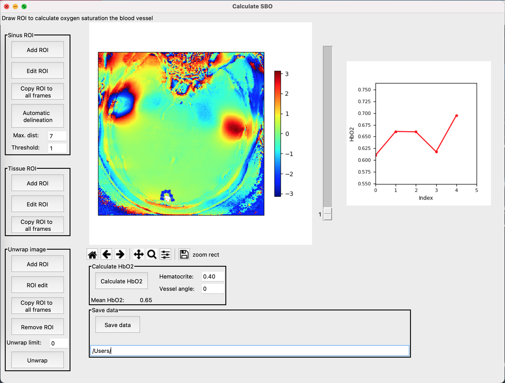

# SBOCalculator

[](https://doi.org/10.5281/zenodo.18743602)

**SBOCalculator** (**S**usceptibility-**B**ased **O**ximetry Calculator) is a Python-based GUI for analyzing susceptibility-based oximetry (SBO) MRI data and quantifying blood oxygen saturation (HbO2).
The software offers an intuitive graphical user interface that enables users to load, visualize, and analyze dual-echo gradient-echo MRI data and calculate oxygen saturation without any programming expertise. Images can be displayed with adjustable colormaps and intensity ranges to optimize vessel and tissue visibility. Regions of interest (ROIs) covering the target blood vessel (sinus ROI) and surrounding brain tissue (tissue ROI) can be defined through manual polygon delineation or generated semi-automatically using a built-in region-growing algorithm. From these ROIs, blood oxygen saturation (HbO2) is calculated using the susceptibility-based oximetry equation. The software also includes a phase unwrapping tool and a vessel angle estimation module for determining the vessel orientation relative to B0 from angiographic data. Results can be exported to CSV format for further statistical analysis. The software was developed so that personnel without a programming background could use it for their analyses, thus widening its usability across clinical and research settings.

Please see following publication describing the technique: 

MRI estimation of global brain oxygen consumption rate. 
V Jain, MC Langham and FW Wehrli
Journal of cerebral blood flow and metabolism, 2010, 30(9):1559-7016, doi: 10.1038/jcbfm.2010.49.


---

## Features

- Supports Philips PAR/REC and NIfTI file formats
- Manual and semi-automatic (region-growing) ROI delineation for both vessel and tissue ROIs
- Blood oxygen saturation (HbO2) quantification from dual-echo phase data
- Selective phase unwrapping tool to correct phase wrapping artefacts
- Vessel-to-B0 angle estimation from angiographic data
- Adjustable hematocrit and vessel angle parameters
- Multi-frame support (e.g., cardiac-gated or dynamic acquisitions)
- Export to CSV

---

## Installation

Clone the repository and install dependencies:

```bash
git clone https://github.com/MarkVestergaard/SBOCalculator.git
cd SBOCalculator
pip install -r requirements.txt
```

The required packages are: tkinter (included with standard Python), matplotlib, nibabel, numpy, pandas, scipy, scikit-image, Pillow, and mpl_point_clicker.

---

## Usage

`SBOCalculator` is launched from the command line:

```bash
cd /path/to/SBOCalculator
python SBOCalculator.py
```

When launched without arguments, a file dialog opens for the user to select the input image file(s). Alternatively, input files and parameters can be specified directly via command-line arguments. For Philips PAR/REC files:

```bash
python SBOCalculator.py --img /path/to/file.PAR
```

For NIfTI files (converted from DICOM using dcm2niix), multiple files are selected in the file dialog corresponding to the modulus and phase images at each echo time.

Optional command-line arguments:

```bash
python SBOCalculator.py --img /path/to/file.PAR --hct 0.43 --angle 10.5 --angio /path/to/angio.PAR
```

- `--hct`: Hematocrit value (default: 0.43)
- `--angle`: Vessel angle relative to B0 in degrees (default: 0)
- `--angio`: Angiographic PAR file for vessel angle estimation

For NIfTI input, JSON sidecar files produced by [dcm2niix](https://github.com/rordenlab/dcm2niix) must be present alongside the NIfTI files.

The analysis workflow consists of:

1. Loading dual-echo phase and modulus images from the SBO acquisition in PAR/REC or NIfTI format
2. Adjusting visualization settings including colormap (jet, grayscale, or viridis) and intensity range to optimize vessel and tissue visibility
3. Switching between image types (Echo 1, Echo 2, Echo difference, Modulus, ROI mask) to identify the vessel and tissue
4. If needed, performing phase unwrapping using the unwrap tool to correct phase wrapping artefacts
5. Defining a sinus ROI around the target blood vessel either by manual polygon delineation or using the semi-automatic region-growing algorithm
6. Defining a tissue ROI in the surrounding brain parenchyma
7. Copying ROIs to all frames, then editing individual frames as needed
8. Entering the hematocrit value and vessel angle relative to B0 (or estimating the angle from angiographic data)
9. Calculating HbO2 and reviewing the oxygen saturation values
10. Saving results in CSV format

---
## Interface


`SBOCalculator` provides a graphical user interface that enables users to load and visualize the dual-echo MRI data, delineate vessels and tissue using ROI tools, and calculate blood oxygen saturation. The interface is organized into three main sections: a control panel on the left for ROI operations (Sinus ROI and Tissue ROI groups), a central image display panel showing the phase or modulus data with ROI overlays, and a right-hand panel displaying the calculated HbO2 values across frames. The displayed image type can be switched between Echo 1, Echo 2, Echo 2 − Echo 1 difference, Modulus, and ROI mask via the top menu (Image → Change Image Type) or by keyboard shortcuts (Ctrl+1 through Ctrl+5). The colormap can be changed between jet, grayscale, and viridis via the menu (Image → Change Colorbar) or by keyboard shortcuts (Ctrl+Q, Ctrl+W, and Ctrl+E). Colorbar intensity limits can also be manually adjusted. If the data contains multiple frames, these can be navigated using either the arrow keys or the slider. New data can be loaded via the top menu (File → Load New File).

`SBOCalculator` provides two methods for sinus ROI delineation. Manual ROIs are drawn by selecting **"Add ROI"** in the Sinus ROI button group, which activates the polygon drawing tool. Polygons are directly drawn on the image using an interactive polygon selector. After drawing, the ROI can be toggled between editable and locked states using the **"Edit ROI"** button. An ROI can be drawn on one frame and copied to all frames, and can be edited on each individual frame. Alternatively, the semi-automatic region-growing algorithm (activated via **"Automatic delineation"**) allows users to place a seed point approximately in the center of the vessel, after which the algorithm grows outward to include neighbouring voxels whose signal values exceed a user-defined threshold. The tissue ROI is drawn manually in the same manner using the Tissue ROI button group.

An **Unwrap image** tool is available for correcting phase wrapping artefacts. The user defines an unwrap ROI, sets a threshold value, and applies the unwrapping to the currently displayed echo image.

Once both ROIs have been defined, the oxygen saturation can be calculated by pressing **"Calculate HbO2"** after entering the hematocrit value and vessel angle. The resulting HbO2 values are displayed in the right-hand panel. Results can be saved as a CSV file containing HbO2, mean sinus phase difference, mean tissue phase difference, hematocrit, and vessel angle for each frame using **"Save Data"**.

The vessel angle relative to B0 can be estimated from angiographic data via the **"Calc vessel B0 angle"** menu, which opens a separate window displaying coronal and sagittal angiographic views with the SBO acquisition plane overlaid.

## Keyboard Shortcuts

| Shortcut | Action |
|----------|--------|
| Ctrl+1–5 | Switch image display (Echo 1, Echo 2, Echo difference, Modulus, ROI mask) |
| Ctrl+Q/W/E | Change colormap (jet, grayscale, viridis) |
| Ctrl+N | Load new file |
| Ctrl+O | Open vessel angle estimation module |
| Ctrl+A | About |
| Up/Down arrows | Navigate through frames |

## References
Please see the following references for research studies in which **SBOCalculator** has been used.

Reproducibility of cerebral blood flow, oxygen metabolism, and lactate and N-acetyl-aspartate concentrations measured using magnetic resonance imaging and spectroscopy:
Signe Sloth Madsen, Ulrich Lindberg, Sohail Asghar, Karsten Skovgaard Olsen, Kirsten Møller, Henrik Bo Wiberg Larsson, Mark Bitsch Vestergaard.
Frontiers in Physiology. 2023; 14:1213352.

Cerebral metabolic rate of oxygen is correlated to treatment effect of electroconvulsive therapy in patients with depression:
Christoffer Cramer Lundsgaard, André Beyer Mathiassen, Henrik Bo Wiberg Larsson, Poul Videbech, Krzysztof Gbyl, Mark Bitsch Vestergaard.
Brain Stimulation. 2025; 18(5):1470-1478.

## Author

**Mark B. Vestergaard**  
Functional Imaging Unit, Department of Clinical Physiology and Nuclear Medicine  
Copenhagen University Hospital Rigshospitalet, Glostrup, Denmark  
mark.bitsch.vestergaard@regionh.dk
markbvestergaard@gmail.com

---
